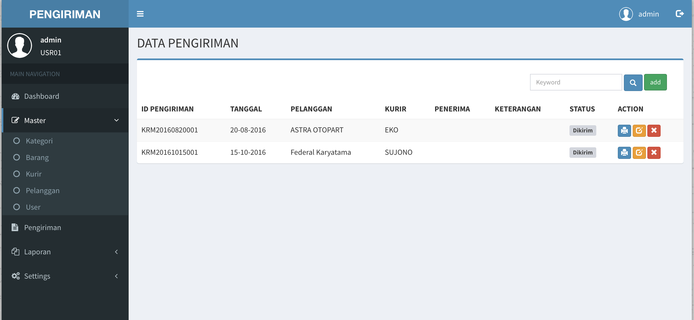
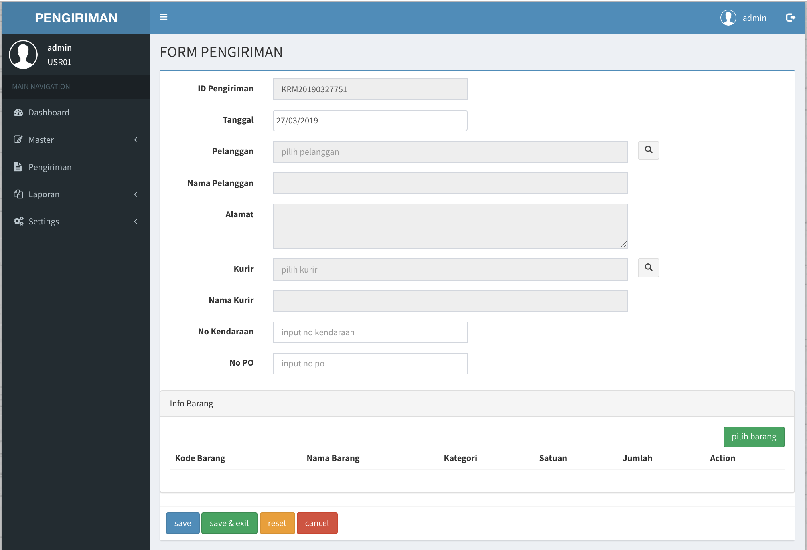
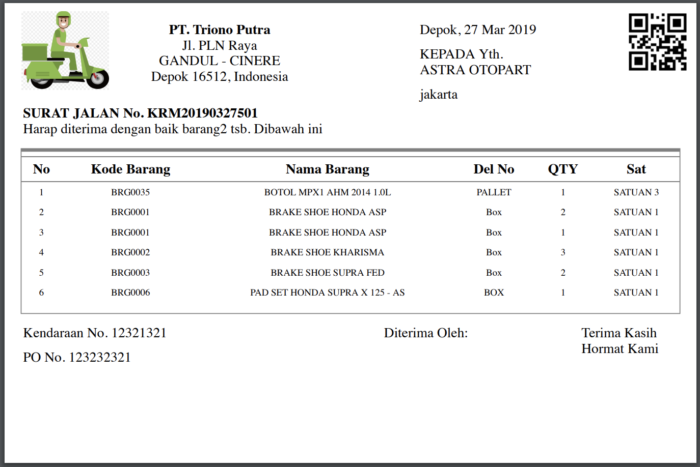

# Aplikasi Pengiriman Barang

Ini merupakan sebuah aplikasi pengiriman senderhana mengunakan framework CI (Codeigniter)

</img>
</img>
 
</img>
</img>

## Modul
#### Login
#### Master
* Data Kategoria
* Data Barang
* Data Kurir
* Data Pelanggan
* Data User
#### Transaksi
* Pengiriman
* Cetak Surat Jalan berserta QRCODE
#### Laporan
* Laporan Pengiriman
#### Settting
* Ganti Password

## Framework & Libraries
- [Codeigniter](https://codeigniter.com)
- [Bootstrap 3](https://getbootstrap.com/docs/3.3/)
- [JQuery](https://jquery.com)
- [AdminLTE](https://adminlte.io)
- [PHPExcel](https://github.com/PHPOffice/PHPExcel)
- [PHPQRCode](http://phpqrcode.sourceforge.net)

Terdapat juga aplikasi android yang digunakan oleh kurir yang berfungsi sebagai konfirmasi penerimaan barang dari pelanggan melalui scan qrcode yang terdapat pada surat jalan sekaligus mengupload gambar sebagai bukti bahwa barang sudah diterima pelanggan yang bisa didownload [disini](https://github.com/trionoputra/android-aplikasi-penerimaan-barang)
